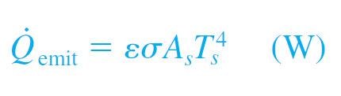

## Intended Learning Outcomes

Students will able to understand the basic mechanisms of heat transfer, which are:
- Conduction
- Convection
- Radiation 
- Fourier's law of heat conduction
- Newton's law of cooling
- Stefan–Boltzmann law of radiation

## Conduction

The rate of heat conduction **Qcond** through a **plane layer** is proportional to the temperature difference **ΔT** and surface area; and is inversely proportional to the thickness.

### Fourier's Law of Heat Conduction

**Thermal conductivity, k**: A measure of the ability of a material to conduct heat. 

For some gasses the conductivity increases with their temperature

**Temperature gradient dT/dx**: The slope of the temperature curve on a T-x diagram.

Heat is conducted in the direction of decreasing temperature, and the temperature gradient becomes negative when temperature decreases with increasing x. The negative sign in the equation ensures that heat transfer in the positive x direction is a positive quantity.

<!-- #### An example

The roof of an electrically heated home is 6 m long, 8 m wide, and 0.25 m thick, and is made of a flat layer of concrete whose thermal conductivity is k 5 0.8 W/m·K (Fig. 1–27). The temperatures of the inner and the outer surfaces of the roof one night are measured to be 15°C and 4°C, respectively, for a period of 10 hours. Determine (a) **the rate of heat loss** through the roof that night and (b) **the cost of that heat loss** to the home owner if the cost of electricity is $0.08/kWh.

 -->

### Thermal Diffusivity

Thermal diffusivity represents how fast heat diffuses through a material.

Note that, the thermal conductivity represents how well a material conducts heat and heat capacity Cp represents how much energy the material stores per unit volume. Therefore, the **thermal diffusivity of a material can be viewed as the ratio of the heat conducted through the material to the heat stored per unit volume.**

## Convection

Energy transfer between a solid surface and surface; uses the effects of conduction and fluid motion. **Faster** fluid motion generally leads to more convective heat transfer.

**Without** fluid motion, convection does not occur, rather heat exchange is carried out by pure conduction.

### Types of Convection

- Forced
  - Fluids is forced to flow over a surface, i.e. with a fan.
- Natural
  - Fluid motion via natural buoyancy forces by fluid density differences
- Change of Phase
  - Heat transfer processes that involve change of phase of a fluid are also considered to be convection because of the fluid motion induced during the process, such as the rise of the vapor bubbles during boiling or the fall of the liquid droplets during condensation.

### Newtons Law of Cooling

Variables:
- h - Convection heat transfer coefficient (W/m2 * °C)
  - Depends on surface geometry, fluid motion nature, fluid properties, fluid velocity
- As - Surface area
- Ts - Surface temperature
- T∞ - Fluid temperature

## Radiation

Heat transfer via energy being emitted as EM waves.

### Stefan-Boltzmann Law

Describes the maximum rate of energy lost through radiation

Variables:
- Q - Max energy lost
- σ - Stefan–Boltzmann constant (5.670 x 10^-28)

For practical applications, ε is the emissivity coefficient between 0 & 1 dependent on surface and temperature.

### Absorptivity (α)

Determines how much a surface absorbs radiation vs reflects/diffuses it; between 0 and 1. An ideal blackbody surface will have α=1, while a perfect mirror will have α=0

### Complete Enclosure

When a surface is completely enclosed by a much larger (or black) surface at temperature Tsurr separated by a gas (such as air) that does not intervene with radiation, the net rate of radiation heat transfer between these two surfaces is given by:

## Combined Heat Transfer

Radiation is usually significant relative to conduction or natural convection, but negligible relative to forced convection.

When radiation and convection occur simultaneously
between a surface and a gas, combined heat transfer coefficient hcombined includes the effects of both convection and radiation.

