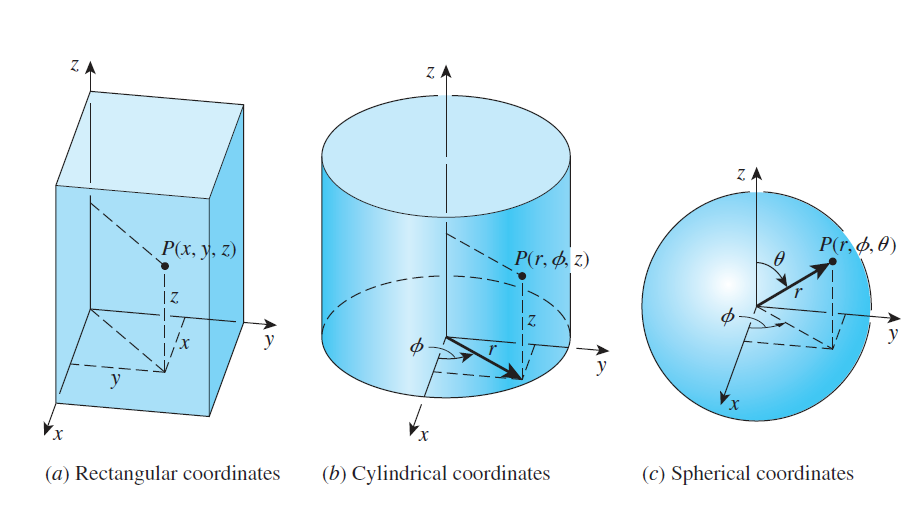
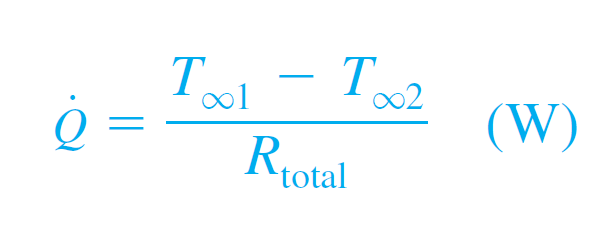

## Intended Learning Outcomes

Students will able to understand the concepts of:
- Conduction
- Thermal Resistance
- Evaluation Techniques of Heat Conduction through:
  - Heat Sources
  - Extended Surfaces
  - Parallel Slabs
  - Composite Cylindrical Tubes
- Lumped System Analysis

## Introduction

Temperature and Heat transfer are closely related but are different in nature

Temperature is a **scalar**, while Heat Transfer is a **vector** 

**ΔT** is the most important component in heat transfer with a strong proportional relation.

When describing heat transfer as a vector, three coordinate systems can be used:
- Rectangular (x,y,z)
- Cylindrical (r,Φ,t)
- Spherical (r,Φ,θ,t)

## Thermal Resistance

Heat transfer can be modelled as a resistance network similar to that of an electrical circuit.

- Q - Rate of heat transfer
- (T1 - T2) - Overall temperature difference
- Rtotal - Overall thermal resistance

